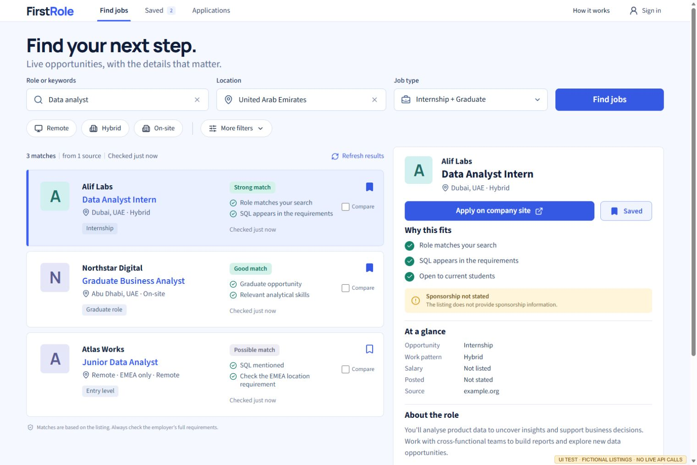

# FirstRole

A job finder and application workspace for students and recent graduates. FirstRole uses TinyFish to discover public careers pages, read individual listings, and navigate portals that need interaction. It turns the results into a shortlist with source links, match reasons, and clear freshness information.

**Delivery status:** the application and automated checks are implemented. Source: [HamdanEsmail/firstrole](https://github.com/HamdanEsmail/firstrole). Public deployment, live Google sign-in, and the complete live bounty demonstration still need verification. `LIVE_DEMO_URL` is a placeholder. See [verification status](docs/qa.md) and the [submission package](docs/submission.md).



## What the app does

- Search by role, location, internship/graduate/entry-level category, workplace, and keywords. Additional filters cover posting age and explicitly offered sponsorship.
- Read job requirements, pay when stated, location restrictions, sponsorship evidence, original sources, and check times. Missing information stays unknown.
- Save jobs, compare up to three, and track Saved, Applied, Interviewing, Offer, Rejected, or Withdrawn, with a personal note and application date.
- Use a guest workspace stored in the browser, or configure Google sign-in to synchronize an account through Supabase. Guest imports preserve existing account notes and application status.
- Refresh a listing, revisit a recent search after reload, export the workspace, and delete an account. Application links open the employer or portal; FirstRole never submits an application.

The desktop interface places the shortlist beside the selected job. On a narrow screen, a job opens in its own detail view with a back action. Source failures and unverified availability are visible; the app does not fill empty searches with invented openings.

## Run locally

Use a current Node.js release supported by the locked Vite and Wrangler versions, and npm. Node 22.12 or later is a practical baseline. Dependencies are locked in `package-lock.json`; use `npm ci` for a reproducible install.

```powershell
npm ci
npm run check
```

`check` runs TypeScript, unit tests, isolated PostgreSQL tests, and the production build. The database tests use PGlite in memory. They do not need Docker, a running PostgreSQL service, a Supabase account, or TinyFish credits.

Start the API and the frontend in separate terminals:

```powershell
npm run dev:api
```

```powershell
npm run dev
```

Open `http://127.0.0.1:5173` in **Microsoft Edge**. Vite forwards `/api` to the local Worker on port 8787. Without service configuration, the guest workspace opens and live searches explain that setup is still required.

For UI verification with fictional test data, use this separate development mode:

```powershell
npm run dev:ui-test
```

Open `http://127.0.0.1:5174` in Edge. The page carries **UI TEST · FICTIONAL LISTINGS · NO LIVE API CALLS**. Its fixture middleware is enabled only while serving this explicit test mode; it is excluded from production builds. Never present fixture screenshots or results as live bounty evidence.

## Connect Supabase, TinyFish, and hosting

The intended pilot uses **Cloudflare Workers/Workflows and Supabase free plans**, a free `workers.dev` address, and no additional language-model provider. No paid domain, subscription, or automatic credit top-up is required by this implementation. Confirm the selected accounts remain on their free plans before enabling a public deployment.

1. Create a new Supabase project and apply `supabase/migrations/202609290001_firstrole.sql`. Read [database setup and spending controls](supabase/README.md). The isolated test bootstrap is never a production migration.
2. Create an ignored `.dev.vars` file for local Worker configuration. Set corresponding configuration and secrets on the deployed Worker. Use the variable reference below.
3. Configure Google OAuth using [accounts and saved workspaces](docs/accounts.md). Leave Google sign-in disabled until the real provider and redirect setup is verified. Guest access does not require Google configuration.
4. Authenticate Cloudflare using Microsoft Edge. If a command supplies an authorization URL, open it in Edge. The checked-in Wrangler configuration declares the static assets, API Worker, and two durable Workflows.
5. After the configuration and free-plan checks, run `npm run deploy`. Set the resulting HTTPS origin as `APP_ORIGIN` and allow its exact sign-in return URL in Supabase. Run the deployed acceptance checks before publishing a demo link.
6. Verify TinyFish rates, the provider's maximum execution exposure, and the remaining allowance before enabling live search. Set the verified timestamp only after checking the actual account. Recheck before the timestamp expires.

Use an ignored `.dev.vars` file with these names; replace placeholders locally:

```dotenv
SUPABASE_URL=https://PROJECT_REF.supabase.co
SUPABASE_PUBLISHABLE_KEY=REPLACE_WITH_PUBLIC_KEY
SUPABASE_SERVICE_ROLE_KEY=REPLACE_WITH_SERVER_SECRET
GUEST_COOKIE_SECRET=REPLACE_WITH_LONG_RANDOM_SECRET
TINYFISH_API_KEY=REPLACE_WITH_TINYFISH_SECRET
APP_ORIGIN=http://127.0.0.1:5173
GOOGLE_AUTH_ENABLED=false
TINYFISH_ENABLED=false
TINYFISH_RATES_VERIFIED_AT=
TINYFISH_AGENT_RATE=0.016
TINYFISH_SEARCH_RATE=0.005
TINYFISH_FETCH_RATE=0.001
```

| Variable                                                             | Purpose                                                                                            |
| -------------------------------------------------------------------- | -------------------------------------------------------------------------------------------------- |
| `SUPABASE_URL`, `SUPABASE_PUBLISHABLE_KEY`                           | Public connection settings supplied to the browser through `/api/config`.                          |
| `SUPABASE_SERVICE_ROLE_KEY`                                          | Worker-only database orchestration and account deletion. Store as a secret.                        |
| `GUEST_COOKIE_SECRET`                                                | Worker-only random signing secret for guest identity and usage pseudonyms.                         |
| `TINYFISH_API_KEY`                                                   | Worker-only provider credential. Never include it in frontend build variables.                     |
| `APP_ORIGIN`                                                         | Exact frontend origin used for request-origin checks.                                              |
| `GOOGLE_AUTH_ENABLED`                                                | Enables the Google sign-in UI after configuration.                                                 |
| `TINYFISH_ENABLED`                                                   | Explicitly enables paid provider work when the other readiness checks pass.                        |
| `TINYFISH_RATES_VERIFIED_AT`                                         | ISO timestamp for the owner's latest rate/exposure verification. Live calls pause after 24 hours.  |
| `TINYFISH_AGENT_RATE`, `TINYFISH_SEARCH_RATE`, `TINYFISH_FETCH_RATE` | Verified rates checked against conservative ceilings of $0.016/step, $0.005/query, and $0.001/URL. |

Use Cloudflare secrets for the service-role key, TinyFish key, and guest-cookie secret. The Google OAuth client secret belongs in Supabase's provider settings. Do not commit secret values or copy them into screenshots, logs, or submission materials.

## How live discovery works

| Stage    | Meaningful TinyFish use                                                                                          | Current implementation bound                                                                                                  |
| -------- | ---------------------------------------------------------------------------------------------------------------- | ----------------------------------------------------------------------------------------------------------------------------- |
| Discover | **Search** finds career pages and individual listings using the submitted role, location, and opportunity types. | Two discovery queries.                                                                                                        |
| Read     | **Fetch** reads career pages and parses supported direct listings, preserving their original links.              | Four initial source pages, favoring different hosts.                                                                          |
| Interact | **Agent** searches or filters a selected careers site and visits individual listings to extract evidence.        | One Agent execution per assisted search, with a 120-second provider duration setting and at most twelve extracted candidates. |
| Verify   | **Fetch** rechecks selected unverified candidates on their original pages.                                       | Up to four follow-up listing reads, or two after the schema-entitlement fallback.                                             |

The schema fallback is allowed only after a conclusive pre-execution schema-access rejection. An uncertain submission is never automatically resubmitted. The second Workflow handles the Agent lifecycle independently of an open browser.

Structured jobs retain source and application URLs, requisition identifiers, salary units, dates, geographic restrictions, and supporting text when available. Deduplication prioritizes employer/requisition identity and canonical URLs. Matching applies the chosen requirements and ranks relevant jobs with understandable reasons rather than an invented hiring probability.

Recent matching searches may be reused for six hours; each job retains its actual check time. A manual search refresh repeats the displayed search's preferences. A failed availability check becomes **Could not verify**, while reliable closure evidence becomes **Closed**. Not every extracted candidate is independently rechecked within the pilot's small allowance; unresolved candidates retain an unverified label.

### Budget controls

The database starts with a **$10 lifetime envelope** for the approved implementation testing and public pilot. Before enabling it, account for any TinyFish calls made outside the application ledger during setup: reduce the application's remaining limit by those confirmed costs. Never treat a fresh database as a fresh spending authorization.

Each provider call requires an atomic database reservation and a unique dispatch claim. Search reserves $0.005/query, Fetch reserves $0.001/URL, and Agent reserves $2.50/start. Unknown Agent costs remain reserved until authoritative reconciliation. Terminal status can release a concurrency slot without releasing the financial reservation. A duration limit alone is not the spending cap.

The current defaults allow two simultaneous Agents globally, one per source hostname, four Agent starts per UTC day, and one assisted search per actor per day. Separate guest/account/network limits protect the shared allowance. The lifetime envelope takes precedence over these daily limits. Saved jobs and eligible cached searches remain available when paid work is paused.

See [database limits and reconciliation](supabase/README.md#limits-and-reconciliation) for the exact admission rules, pause control, and operator responsibilities.

## Interfaces and project structure

| Interface                       | Behavior                                                                                                    |
| ------------------------------- | ----------------------------------------------------------------------------------------------------------- |
| `GET /api/config`               | Public settings and feature readiness, without privileged credentials.                                      |
| `GET /api/health`               | Basic Worker availability. This does not prove the database or provider is ready.                           |
| `POST /api/searches`            | `{ preferences, forceRefresh? }`; requires an `Idempotency-Key`; returns the owned `SearchRun`.             |
| `GET /api/searches/:id`         | Authorized progress, results, and partial failures.                                                         |
| `POST /api/searches/:id/cancel` | Stops additional work and requests cancellation of known Agent runs.                                        |
| `POST /api/jobs/:id/refresh`    | Rechecks a previously authorized listing; accepts optional `{ searchId }`.                                  |
| `POST /api/account/delete`      | Deletes the verified user's FirstRole account and personal records. Requires an authenticated bearer token. |

Guest API access uses an HttpOnly signed cookie. Account access uses a Supabase bearer token verified by the Worker. Browser account tables enforce row ownership through PostgreSQL policies. Refresh destinations come from server-verified job records; a browser-edited saved snapshot cannot choose an arbitrary URL.

`src` contains the React interface and account client. `server` contains the Worker, Workflows, TinyFish adapter, and job-quality rules. `shared` defines the typed contracts. `supabase` contains the migration and database operating notes. `tests` contains unit, isolated database, and explicitly separated UI fixtures.

## Verification and remaining release work

Automated tests cover extraction and matching, missing fields, closure evidence, deduplication, provider request bounds, unknown Agent outcomes, ownership policies, private RPC permissions, spending limits, retry claims, guest imports, and account API behavior. The current evidence and its limits are recorded in [QA](docs/qa.md).

Before calling the bounty complete, verify the deployed demo in Edge with real opportunities from multiple companies, roles, and at least two regions. Demonstrate a necessary Agent interaction, Google sign-in across two sessions, account isolation, and the shared budget under concurrent requests. Verify free-plan execution limits and restore a paused Supabase project if needed. Add real demo/repository links, screenshots, and a short walkthrough to the [submission package](docs/submission.md).
