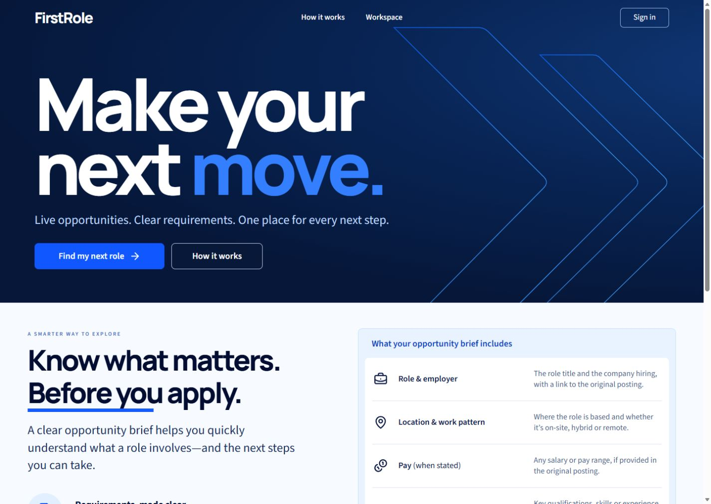
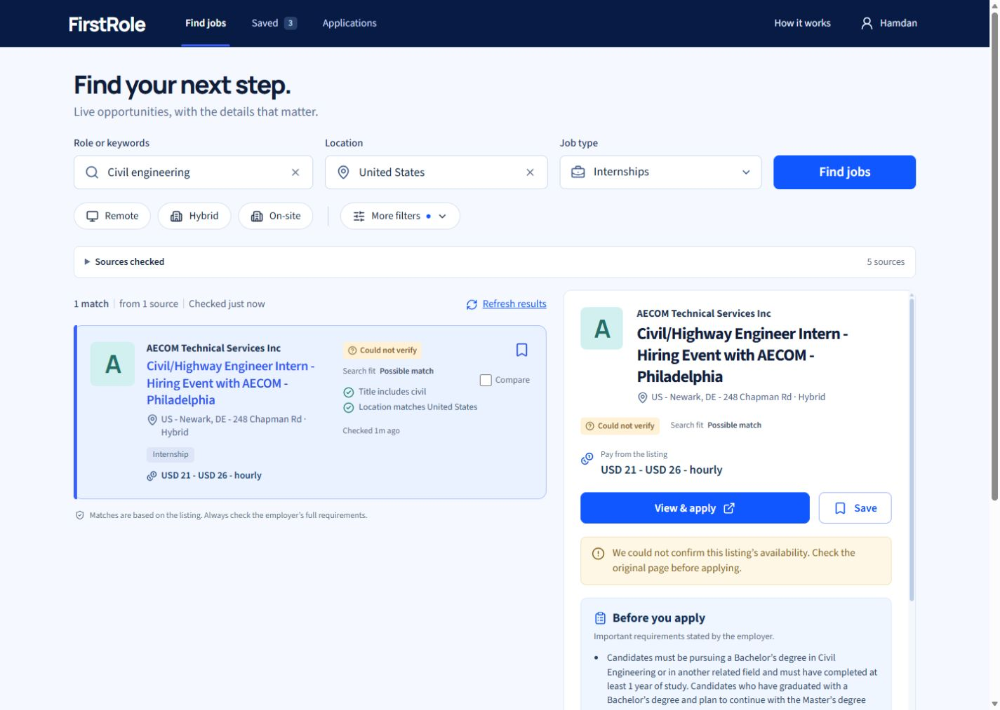

# FirstRole

A job finder and application workspace for students and recent graduates. FirstRole uses TinyFish to discover public careers pages, read individual listings, and navigate portals that need interaction. It turns the results into a shortlist with source links, match reasons, and clear freshness information.

**Public demo:** [Open FirstRole](https://firstrole.hamdanesmail12-7a9.workers.dev). **Source:** [HamdanEsmail/firstrole](https://github.com/HamdanEsmail/firstrole).



## What the app does

- Search by role, location, internship/graduate/entry-level category, workplace, and keywords. Additional filters cover posting age and explicitly offered sponsorship.
- Read job requirements, pay when stated, location restrictions, sponsorship evidence, original sources, and check times. Missing information stays unknown.
- Save jobs, compare up to three, and track Saved, Applied, Interviewing, Offer, Rejected, or Withdrawn, with a personal note and application date.
- Use a guest workspace stored in the browser, or configure Google sign-in to synchronize an account through Supabase. Guest imports preserve existing account notes and application status.
- Refresh a listing, revisit a recent search after reload, export the workspace, and delete an account. Application links open the employer or portal; FirstRole never submits an application.

The desktop interface places the shortlist beside the selected job. On a narrow screen, a job opens in its own detail view with a back action. Source failures and unverified availability are visible; the app does not fill empty searches with invented openings.



## Run locally

Use a current Node.js release supported by the locked Vite and Wrangler versions, and npm. Node 22.12 or later is a practical baseline. Dependencies are locked in `package-lock.json`; use `npm ci` for a reproducible install.

```powershell
npm ci
npm run check
```

`check` runs TypeScript, unit tests, isolated PostgreSQL tests, and the production build. The database tests use PGlite in memory. They do not need Docker, a running PostgreSQL service, a Supabase account, or TinyFish credits.

Start the API and the frontend in separate terminals:

```powershell
npm run dev:api
```

```powershell
npm run dev
```

Open `http://127.0.0.1:5173` in **Microsoft Edge**. Vite forwards `/api` to the local Worker on port 8787. Without service configuration, the guest workspace opens and live searches explain that setup is still required.

For UI verification with fictional test data, use this separate development mode:

```powershell
npm run dev:ui-test
```

Open `http://127.0.0.1:5174` in Edge. The page carries **UI TEST · FICTIONAL LISTINGS · NO LIVE API CALLS**. Its fixture middleware is enabled only while serving this explicit test mode; it is excluded from production builds. The fixtures are for local interface checks and are never included as production search results.

## Connect Supabase, TinyFish, and hosting

FirstRole targets **Cloudflare Workers/Workflows and Supabase free plans** and a free `workers.dev` address. TinyFish provides discovery, reading and browser interaction. Optional Firecrawl recovery uses its free allowance; optional Gemma extraction through OpenRouter has a separate $1 lifetime cap. Both helpers can be disabled without removing the core product. No paid domain, subscription, or automatic credit top-up is required. Confirm account plans and allowances before enabling a public deployment.

1. Create a new Supabase project and apply all numbered SQL files in `supabase/migrations` in filename order. They create the workspace, budget controls, and private provider-rate cache. Read [database setup and spending controls](supabase/README.md). The isolated test bootstrap is never a production migration.
2. Create an ignored `.dev.vars` file for local Worker configuration. Set corresponding configuration and secrets on the deployed Worker. Use the variable reference below.
3. Configure Google OAuth using [accounts and saved workspaces](docs/accounts.md). Leave Google sign-in disabled until the real provider and redirect setup is verified. Guest access does not require Google configuration.
4. Authenticate Cloudflare using Microsoft Edge. If a command supplies an authorization URL, open it in Edge. The checked-in Wrangler configuration declares the static assets, API Worker, and three durable Workflows.
5. After the configuration and free-plan checks, run `npm run deploy`. Set the resulting HTTPS origin as `APP_ORIGIN` and allow its exact sign-in return URL in Supabase. Run the deployed acceptance checks before publishing a demo link.
6. Verify the provider's maximum execution exposure and remaining allowance before enabling live search. The server verifies account-specific TinyFish rates through the documented wallet metadata endpoint and refreshes its private proof when the six-hour cache expires. Missing or increased rates pause new paid work; no daily configuration change or redeployment is required.

Use an ignored `.dev.vars` file with these names; replace placeholders locally:

```dotenv
SUPABASE_URL=https://PROJECT_REF.supabase.co
SUPABASE_PUBLISHABLE_KEY=REPLACE_WITH_PUBLIC_KEY
SUPABASE_SERVICE_ROLE_KEY=REPLACE_WITH_SERVER_SECRET
GUEST_COOKIE_SECRET=REPLACE_WITH_LONG_RANDOM_SECRET
TINYFISH_API_KEY=REPLACE_WITH_TINYFISH_SECRET
APP_ORIGIN=http://127.0.0.1:5173
GOOGLE_AUTH_ENABLED=false
TINYFISH_ENABLED=false
TINYFISH_RATES_VERIFIED_AT=
TINYFISH_RATES_KEY_SHA256=
TINYFISH_AGENT_RATE=0.016
TINYFISH_SEARCH_RATE=0.005
TINYFISH_FETCH_RATE=0.001
```

| Variable                                                             | Purpose                                                                                                                                                               |
| -------------------------------------------------------------------- | --------------------------------------------------------------------------------------------------------------------------------------------------------------------- |
| `SUPABASE_URL`, `SUPABASE_PUBLISHABLE_KEY`                           | Public connection settings supplied to the browser through `/api/config`.                                                                                             |
| `SUPABASE_SERVICE_ROLE_KEY`                                          | Worker-only database orchestration and account deletion. Store as a secret.                                                                                           |
| `GUEST_COOKIE_SECRET`                                                | Worker-only random signing secret for guest identity and usage pseudonyms.                                                                                            |
| `TINYFISH_API_KEY`                                                   | Worker-only provider credential. Never include it in frontend build variables.                                                                                        |
| `APP_ORIGIN`                                                         | Exact frontend origin used for request-origin checks.                                                                                                                 |
| `GOOGLE_AUTH_ENABLED`                                                | Enables the Google sign-in UI after configuration.                                                                                                                    |
| `TINYFISH_ENABLED`                                                   | Explicitly enables paid provider work when the other readiness checks pass.                                                                                           |
| `TINYFISH_RATES_VERIFIED_AT`, `TINYFISH_RATES_KEY_SHA256`            | Optional initial manual proof: a UTC timestamp at most 24 hours old, bound to the current API key's SHA-256. When unset, rates are verified automatically at runtime. |
| `TINYFISH_AGENT_RATE`, `TINYFISH_SEARCH_RATE`, `TINYFISH_FETCH_RATE` | Initial manual rates. Runtime wallet proofs validate exact USD meters and units against ceilings of $0.016/step, $0.005/query, and $0.001/URL.                        |
| `OPENROUTER_ENABLED`, `OPENROUTER_API_KEY` | Optional server-only Gemma extraction. Use a dedicated key with a $1 total limit and no resetting allowance. |
| `OPENROUTER_PROVIDER` | One pinned, allowlisted host for the fixed Gemma model. The pilot uses `nextbit/bf16`; runtime verifies its schema support and rates. |
| `FIRECRAWL_ENABLED`, `FIRECRAWL_API_KEY` | Optional server-only recovery of empty or JavaScript-shell detail pages after TinyFish. |
| `FIRECRAWL_FREE_PLAN_VERIFIED_AT`, `FIRECRAWL_FREE_PLAN_KEY_SHA256` | Owner-confirmed free-plan timestamp and key fingerprint. Expires after 30 days; a paid-sized allowance or exhausted credits disables recovery. |

Use Cloudflare secrets for the service-role key, TinyFish key, and guest-cookie secret. The Google OAuth client secret belongs in Supabase's provider settings. Do not commit secret values or copy them into screenshots, logs, or submission materials.

Automatic rate proofs are private, expire after six hours, and are keyed by the API key's hash. The wallet metadata read cannot start an Agent, buy credits, reset the $10 pilot ledger, or change reserved charges. Invalid, unavailable, or excessive rates fail closed for new paid work while saved and cached job results remain usable. See [database rate verification](supabase/README.md#automatic-provider-rate-verification).

## How live discovery works

| Stage    | Meaningful TinyFish use                                                                                          | Current implementation bound                                                                                    |
| -------- | ---------------------------------------------------------------------------------------------------------------- | --------------------------------------------------------------------------------------------------------------- |
| Discover | **Search** finds career pages and individual listings using the submitted role, location, and opportunity types. | Up to three discovery queries.                                                                                  |
| Read     | **Fetch** reads career pages and parses supported direct listings, preserving their original links.              | Four initial pages, favoring different hosts, plus up to two observed listing links.                            |
| Interact | **Agent** searches or filters an employer site only when ordinary reading is insufficient.                       | One Agent execution per eligible assisted search, a 120-second execution setting, and one extracted opening.    |
| Verify   | **Fetch** checks the new Agent-produced opening on its original page.                                            | At most one read; already-open results from earlier Fetch calls are not rechecked just to exercise an endpoint. |

The schema fallback is allowed only after a conclusive pre-execution schema-access rejection. An uncertain submission is never automatically resubmitted. The second Workflow handles the Agent lifecycle independently of an open browser.

An optional third Workflow checks difficult posting details **after TinyFish's reading and any eligible Agent work**. It can recover an empty detail page with a basic Firecrawl scrape, or ask `google/gemma-4-26b-a4b-it` through a pinned, allowlisted OpenRouter endpoint to extract facts from already-read public text. Exact source excerpts are required; identifiers and application destinations remain server-controlled. It does not receive account data, application notes or search preferences. The existing parser remains the fallback.

The two optional providers share a maximum of two dispatches per search. Separate atomic ledgers enforce $1 total OpenRouter spend and 100 free Firecrawl reads for the pilot. Unknown charges retain their reservations, submissions have no automatic retries, and the TinyFish $10 ledger is unchanged. OpenRouter rates and structured-output support are checked against its official endpoint metadata; price increases beyond the configured ceiling disable model work. See [optional provider setup](docs/deployment.md#optional-detail-helpers).

The pilot allows up to eight minutes for provider startup and completion through eight scheduled status reads, sixty seconds apart. Database cancellation checks occur every thirty seconds, and the Cancel action also requests provider cancellation directly. This waiting allowance does not raise the 120-second provider execution setting or the $2.50 reservation. If cancellation races with successful completion, the existing result is retrieved without another submission. Known aggregators, explicit missing-page shells, and employer portals already covered by verified followup results are excluded from Agent selection.

Structured jobs retain source and application URLs, requisition identifiers, salary units, dates, geographic restrictions, and supporting text when available. Deduplication prioritizes employer/requisition identity and canonical URLs. Matching applies the chosen requirements and ranks relevant jobs with understandable reasons rather than an invented hiring probability.

Recent matching searches may be reused for six hours; each job retains its actual check time. A manual search refresh repeats the displayed search's preferences. A failed availability check becomes **Could not verify**, while reliable closure evidence becomes **Closed**. Not every extracted candidate is independently rechecked within the pilot's small allowance; unresolved candidates retain an unverified label.

Completed search and cache reads incorporate newer server-owned job facts, then reapply the search's filters and ranking. Older Workflow observations cannot overwrite a newer catalog check. This preserves cache expiry and leaves saved application notes and status unchanged.

### Budget controls

The default deployment has a **$10 lifetime search budget**. All provider dispatches share that limit. If setup calls are made outside the application ledger, include those costs when setting the remaining deployment allowance.

Each provider call requires an atomic database reservation and a unique dispatch claim. Search reserves $0.005/query, Fetch reserves $0.001/URL, and Agent reserves $2.50/start. Unknown Agent costs remain reserved until authoritative reconciliation. Terminal status can release a concurrency slot without releasing the financial reservation. A duration limit alone is not the spending cap.

The current defaults allow two simultaneous Agents globally, one per source hostname, four Agent starts per UTC day, and one assisted search per actor per day. Separate guest/account/network limits protect the shared allowance. The lifetime envelope takes precedence over these daily limits. Saved jobs and eligible cached searches remain available when paid work is paused.

See [database limits and reconciliation](supabase/README.md#limits-and-reconciliation) for the exact admission rules, pause control, and operator responsibilities.

## Interfaces and project structure

| Interface                       | Behavior                                                                                                    |
| ------------------------------- | ----------------------------------------------------------------------------------------------------------- |
| `GET /api/config`               | Public settings and feature readiness, without privileged credentials.                                      |
| `GET /api/health`               | Basic Worker availability. This does not prove the database or provider is ready.                           |
| `POST /api/searches`            | `{ preferences, forceRefresh? }`; requires an `Idempotency-Key`; returns the owned `SearchRun`.             |
| `GET /api/searches/:id`         | Authorized progress, results, and partial failures.                                                         |
| `POST /api/searches/:id/cancel` | Stops additional work and requests cancellation of known Agent runs.                                        |
| `POST /api/jobs/:id/refresh`    | Rechecks a previously authorized listing; accepts optional `{ searchId }`.                                  |
| `POST /api/account/delete`      | Deletes the verified user's FirstRole account and personal records. Requires an authenticated bearer token. |

Guest API access uses an HttpOnly signed cookie. Configuration establishes that cookie when possible. A first search that needs a new cookie receives a no-spend `425 GUEST_SESSION_READY` response; the client repeats it once with the same idempotency key. Admission begins only after the browser returns its signed cookie. If cookies are blocked, the client stops with a clear message instead of repeatedly starting work. Account access uses a Supabase bearer token verified by the Worker. Browser account tables enforce row ownership through PostgreSQL policies. Refresh destinations come from server-verified job records; a browser-edited saved snapshot cannot choose an arbitrary URL.

`src` contains the React interface and account client. `server` contains the Worker, Workflows, TinyFish adapter, and job-quality rules. `shared` defines the typed contracts. `supabase` contains the migration and database operating notes. `tests` contains unit, isolated database, and explicitly separated UI fixtures.

## Validation and limitations

Run `npm run check` for TypeScript, unit tests, isolated PostgreSQL tests, and the production build. The provider tests use recorded or mocked responses; the database suites run in PGlite without touching a live project. Tests cover matching and source evidence, ownership policies, guest imports, idempotency, bounded requests, budget admission, and uncertain Agent outcomes.

The opt-in scripts under `tests/integration` check a configured deployment. Account mutation checks create disposable QA users and remove them; read the script and target configuration before running one. Setup and operating guidance is available in [Accounts](docs/accounts.md), [Deployment](docs/deployment.md), and [Database](supabase/README.md).

Source coverage depends on the employer's site and provider access. A portal may block automated reading, and an Agent interaction may return no usable listings. FirstRole displays partial coverage and unverified availability explicitly. Search results reflect the source at the recorded check time and cannot guarantee that a position is still open or that an applicant meets every requirement.

Cached results and browser-local saves remain usable when new paid work is paused. Free hosting/database quotas, source availability, and the configured shared allowance can limit new searches. Measure deployed Worker CPU and request usage before increasing the bounds; workflow elapsed time does not establish CPU headroom.
